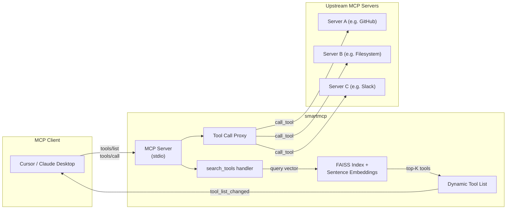

# smartmcp Build Plan (19 commits)

## Architecture Overview




## Data Flow (Option B)

1. On startup: connect to upstream servers, collect all tool schemas, embed them, build FAISS index
2. Client calls `tools/list` -> smartmcp returns only `search_tools`
3. LLM calls `search_tools(query="create github issue")` -> embed query, FAISS top-3 lookup -> update dynamic tool list -> send `tool_list_changed` notification
4. Client re-fetches `tools/list` -> smartmcp returns `search_tools` + the 3 matched tools with full schemas
5. LLM calls `github__create_issue(...)` -> smartmcp proxies to the GitHub upstream server -> returns result

## Key SDK Patterns

- **Server side**: Low-level `Server` class with `on_list_tools` and `on_call_tool` handlers, `NotificationOptions(tools_changed=True)`, `ctx.session.send_tool_list_changed()`
- **Client side**: `StdioServerParameters` + `stdio_client()` + `ClientSession` with `list_tools()` and `call_tool()`
- **Lifespan**: Server `lifespan` async context manager for startup init (connect upstream, build index)

## Package Structure

```
smartmcp/
  __init__.py       # version + package exports
  __main__.py       # python -m smartmcp support
  config.py         # load/validate smartmcp.json
  embedding.py      # sentence-transformers model + FAISS index + search
  upstream.py       # upstream MCP client connections + tool collection
  server.py         # MCP server facing the client + tool proxying
  cli.py            # CLI arg parsing + orchestration
```

## Dependencies

- `mcp>=1.0` — official MCP Python SDK (server + client + types)
- `sentence-transformers>=2.0` — local embedding model
- `faiss-cpu>=1.7` — vector similarity search
- `click` — CLI parsing (already a dep of mcp)
- `anyio` — async runtime (already a dep of mcp)
- `numpy` — array ops (already a dep of faiss/sentence-transformers)

## Commit Sequence

**Commit 1 — chore: add pyproject.toml with project metadata and dependencies**

- Create `pyproject.toml` with project name `smartmcp`, version `0.1.0`, Python `>=3.10`, all dependencies, console_scripts entry point `smartmcp = smartmcp.cli:main`

**Commit 2 — feat: create smartmcp package with `__init__.py`**

- Create `smartmcp/__init__.py` with `__version__` and package docstring

**Commit 3 — feat: add configuration schema and JSON loading**

- Create `smartmcp/config.py`
- Pydantic-style dataclass or simple dict validation for `smartmcp.json`
- Fields: `mcpServers` (dict of server name -> {command, args, env}), `top_k` (default 3), `embedding_model` (default `all-MiniLM-L6-v2`)
- Load from file path, validate required fields, return typed config

**Commit 4 — feat: add CLI argument parsing entry point**

- Create `smartmcp/cli.py` with click-based CLI
- `--config` flag (required, path to smartmcp.json)
- Calls config loader, will eventually start the server

**Commit 5 — feat: add `__main__.py` for `python -m smartmcp` support**

- Create `smartmcp/__main__.py` that imports and calls `cli.main()`

**Commit 6 — feat: add upstream server connection manager**

- Create `smartmcp/upstream.py`
- `UpstreamManager` class that holds `AsyncExitStack`, spawns each configured server via `stdio_client` + `ClientSession`, stores sessions keyed by server name
- `connect_all(config)` async method
- Cleanup via exit stack

**Commit 7 — feat: add tool schema collection from connected servers**

- Extend `UpstreamManager` with `collect_tools()` method
- Calls `session.list_tools()` on each connected server
- Returns list of `(server_name, tool_schema)` tuples

**Commit 8 — feat: add server-name prefixing for tool names**

- Add `prefix_tool_name(server_name, tool_name)` utility -> `"servername__toolname"`
- Add `parse_prefixed_name(prefixed)` -> `(server_name, tool_name)` reverse lookup
- Apply prefixing during tool collection

**Commit 9 — feat: add tool text extraction for embedding input**

- In `embedding.py`, add function that takes a tool schema and produces a single text string for embedding: `"{name} {description} {param_names_and_descriptions}"`

**Commit 10 — feat: add embedding model loader**

- In `embedding.py`, add `EmbeddingIndex` class with `__init__(model_name)` that loads the sentence-transformers model

**Commit 11 — feat: add FAISS index building from tool embeddings**

- Extend `EmbeddingIndex` with `build_index(tools)` method
- Embeds all tool texts, builds `faiss.IndexFlatIP` (inner product for cosine sim on normalized vectors)
- Stores tool metadata alongside index for result mapping

**Commit 12 — feat: add semantic search query function**

- Extend `EmbeddingIndex` with `search(query, top_k)` method
- Embeds query, searches FAISS index, returns top-K tool schemas with scores

**Commit 13 — feat: create MCP server with lifespan initialization**

- Create `smartmcp/server.py`
- Define `lifespan` async context manager that: connects upstream servers, collects tools, builds embedding index
- Create low-level `Server` instance with `on_list_tools` and `on_call_tool` handlers (stubs for now)
- Wire up stdio transport and `server.run()`

**Commit 14 — feat: implement `search_tools` tool definition and handler**

- Define the `search_tools` tool schema (params: `query: str`, optional `top_k: int`)
- In `on_call_tool`, handle `search_tools` -> call `EmbeddingIndex.search()` -> return results as text content

**Commit 15 — feat: implement dynamic tool list management**

- Add state tracking: `active_tools` list (starts empty)
- `on_list_tools` returns `search_tools` + whatever is in `active_tools`
- After `search_tools` runs, populate `active_tools` with matched tool schemas (replacing previous)

**Commit 16 — feat: send `tool_list_changed` notification after search**

- After updating `active_tools`, call `ctx.session.send_tool_list_changed()`
- Ensure `NotificationOptions(tools_changed=True)` is set in init options

**Commit 17 — feat: implement tool call proxying to upstream servers**

- In `on_call_tool`, for any tool that isn't `search_tools`:
  - Parse prefixed name to get `(server_name, original_tool_name)`
  - Look up the upstream session for that server
  - Call `session.call_tool(original_tool_name, arguments)`
  - Return the result as-is

**Commit 18 — feat: add graceful degradation for failed upstream servers**

- Wrap each upstream server connection in try/except
- Log warnings for failed connections with server name and error
- Continue with remaining servers
- If zero servers connect, exit with clear error message

**Commit 19 — chore: add example smartmcp.json configuration file**

- Create `smartmcp.example.json` with 2-3 example server configs (commented descriptions)

